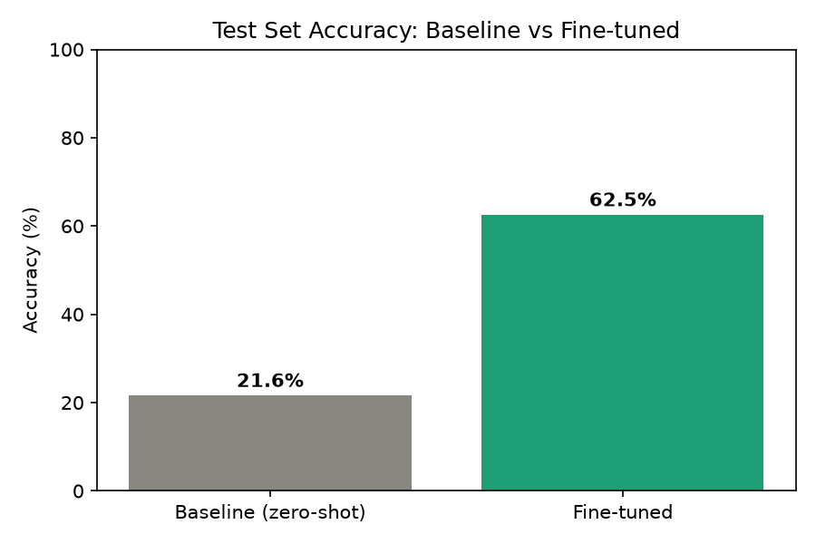
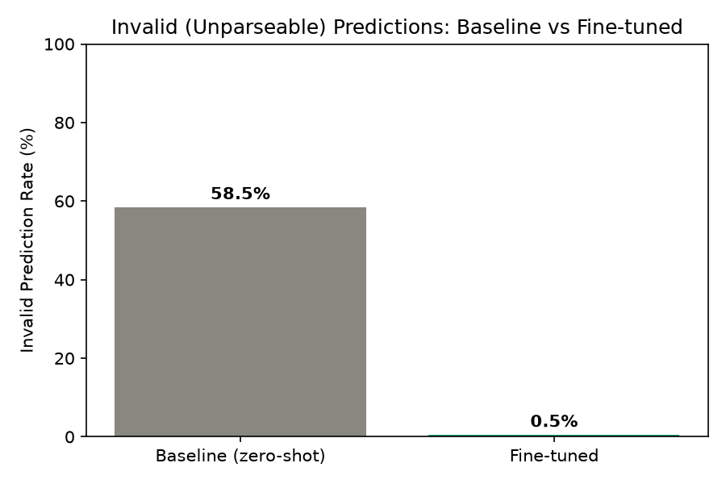

# Contract Clause QLoRA

Fine-tuning **Phi-3-mini-4k-instruct** with **QLoRA** to classify legal contract clauses into one of CUAD's 41 categories (plus "None"), trained on the [CUAD](https://www.atticusprojectai.org/cuad) (Contract Understanding Atlas Dataset) dataset.

Runs locally via `streamlit run app.py` (see [Running it yourself](#running-it-yourself) below) — public deployment was attempted and set aside due to free-tier memory constraints; see [`deploy/`](deploy/README.md) for what was tried.

## Results

| Metric | Baseline (zero-shot Phi-3) | Fine-tuned |
|---|---|---|
| Accuracy | 21.6% | **62.5%** |
| Invalid (unparseable) output rate | 58.5% | **0.5%** |

The invalid-rate gap is arguably the more striking result: over half the time, the zero-shot base model doesn't produce a recognizable category label at all. Fine-tuning didn't just improve *which* category gets picked — it taught the model to reliably produce valid, structured output in the first place.




Full analysis — per-category precision/recall/F1, a qualitative investigation into the model's error patterns, and honest discussion of known limitations — is in [`notebooks/eval.ipynb`](notebooks/eval.ipynb).

## How it works

1. **Data prep** ([`scripts/build_dataset.py`](scripts/build_dataset.py), [`src/contract_clause_qlora/cuad.py`](src/contract_clause_qlora/cuad.py)): builds positive examples from CUAD's annotated clause spans, constructs negative ("None") examples from the unannotated text gaps between them, splits by *contract* (not clause) to prevent leakage, and formats everything into Phi-3's chat template as single-label classification prompts.
2. **Training** ([`notebooks/train_qlora.ipynb`](notebooks/train_qlora.ipynb)): QLoRA fine-tuning — the base model loads in 4-bit (`bitsandbytes`), only a small LoRA adapter (~0.57% of total parameters) is trained, using `trl`'s `SFTTrainer` with completion-only loss masking.
3. **Evaluation** ([`notebooks/eval.ipynb`](notebooks/eval.ipynb)): baseline (zero-shot) vs. fine-tuned compared on a held-out test set, using `peft`'s `disable_adapter()` to get both variants from a single loaded model.
4. **Demo** ([`app.py`](app.py)): a Streamlit app for trying the classifier on your own clause text, showing baseline vs. fine-tuned side by side.

## Engineering challenges

A few things worth calling out, since they shaped real decisions in this project:

- **Free-tier GPU constraints drove the training config.** Colab's free-tier T4 (Turing architecture) has no native bf16 support, and a documented `bitsandbytes`/PyTorch `GradScaler` bug (matching [pytorch#127176](https://github.com/pytorch/pytorch/issues/127176)) ruled out fp16 too — forcing full fp32 training. At the original planned scope, that was estimated at ~55 hours; the training scope (category cap, epoch count) was reduced to fit a realistic free-tier session budget while preserving rare-category representation.
- **A genuinely difficult debugging session** traced a reproducible, silent training hang through five ruled-out hypotheses (LoRA dtype, precision-mode mismatch, DataLoader worker/pinned-memory interaction, gradient checkpointing mode) before discovering the actual cause: a Colab kernel that had never been genuinely restarted across "different" test runs, carrying contaminated GPU/process state between them.
- **The evaluation includes real failure-mode analysis**, not just an accuracy number — a qualitative investigation into *why* the model's `None`-class recall is imperfect (a mix of genuine CUAD annotation gaps and real model imprecision), and a most-confused-category-pairs analysis surfacing specific, interpretable error patterns rather than a raw confusion matrix.
- **Public deployment hit a genuine platform memory ceiling.** Two diagnosed failures on Streamlit Community Cloud's free tier — a dependency-file auto-detection conflict, then a silent process kill during model loading consistent with the transient memory spike quantized loading requires (holding original fp16 weights before conversion, well above the final ~2GB quantized size). See [`deploy/`](deploy/README.md) for the full investigation and the decision to run locally instead.

## Known limitations

- **Single-label classification only.** A clause matching multiple categories simultaneously is out of scope for this project.
- **Rare categories have unreliable metrics.** Several categories have fewer than 10 test examples (as few as 1); their individual precision/recall/F1 should be read as directional, not statistically reliable — reported transparently via `support` counts rather than hidden.
- **Reduced training scope due to compute constraints** (see above) likely leaves some accuracy on the table relative to the original, larger-scope plan.
- **The "None" class is heuristically constructed** from CUAD's unannotated text gaps, not independently verified as true negatives — this introduces some genuine label noise, discussed in detail in the eval notebook.

## Project structure

```text
scripts/build_dataset.py   - data pipeline: raw CUAD -> train/val/test JSONL
src/contract_clause_qlora/ - reusable package (data processing, prompt formatting, parsing)
notebooks/train_qlora.ipynb - QLoRA fine-tuning (run on Colab, T4 GPU)
notebooks/eval.ipynb        - baseline vs. fine-tuned evaluation and analysis
app.py                      - Streamlit demo
```

## Running it yourself

Dependency management uses [`uv`](https://docs.astral.sh/uv/).

```bash
uv sync
uv run scripts/build_dataset.py   # regenerates data/processed/*.jsonl from raw CUAD
```

Training (`notebooks/train_qlora.ipynb`) is designed to run on a CUDA GPU with at least ~15GB VRAM (developed on Colab's free-tier T4) — see the notebook for environment setup. Evaluation (`notebooks/eval.ipynb`) and the demo app (`app.py`) run fine on CPU, if slowly.

```bash
streamlit run app.py
```

## Model

The fine-tuned LoRA adapter is published at [`DLCS/contract-clause-phi3-lora`](https://huggingface.co/DLCS/contract-clause-phi3-lora) on the Hugging Face Hub.
